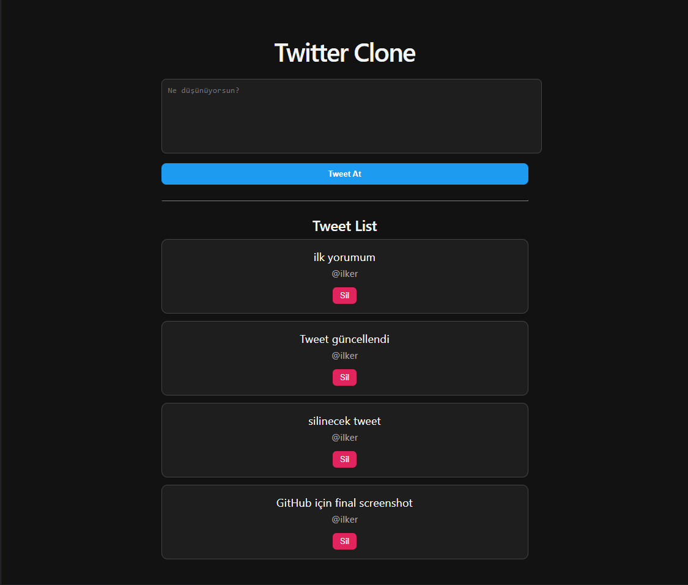

# 🚀 Twitter Clone Fullstack

A fullstack Twitter clone built with **Spring Boot + React (Vite)**.

---

## 🛠 Tech Stack

- **Backend:** Spring Boot
- **Frontend:** React (Vite)
- **Database:** PostgreSQL
- **Security:** Spring Security
- **API:** REST API

---

## ✨ Features

- 📝 Create / Update / Delete Tweet
- 💬 Comment system
- ❤️ Like / Dislike
- 🔁 Retweet
- 🔐 Authentication (Register / Login)
- 🌐 CORS configuration

---

## 📸 App Preview



---

## ▶️ How to Run

### Backend

```bash
mvn spring-boot:run
```

### Frontend

```bash
cd twitter-frontend
npm install
npm run dev
```

---

## 👨‍💻 Author

**İlker Uğur Demir**